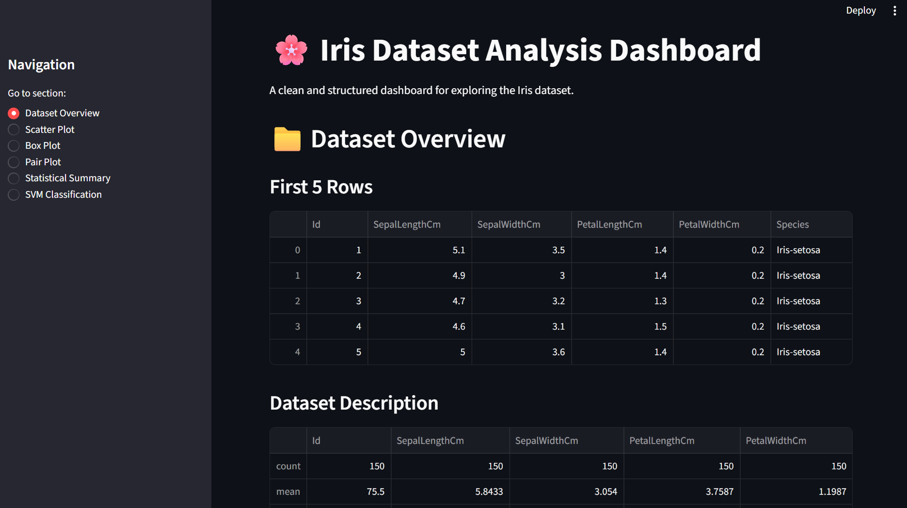
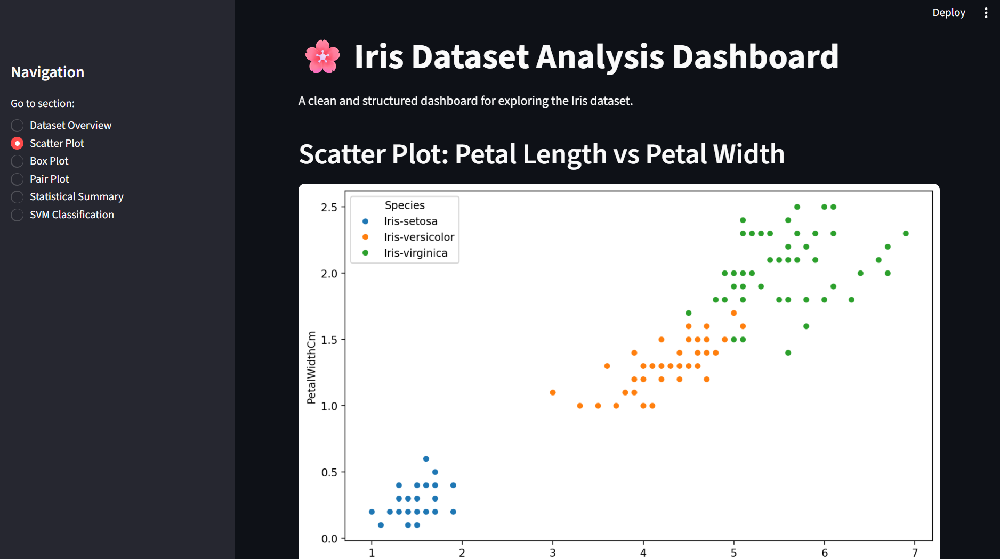
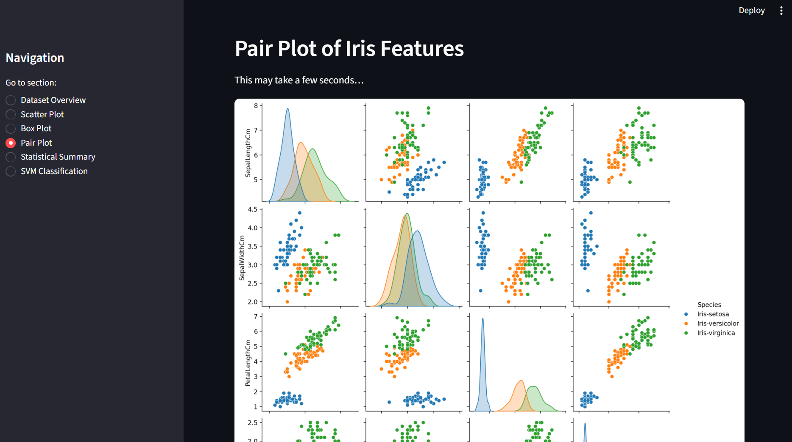
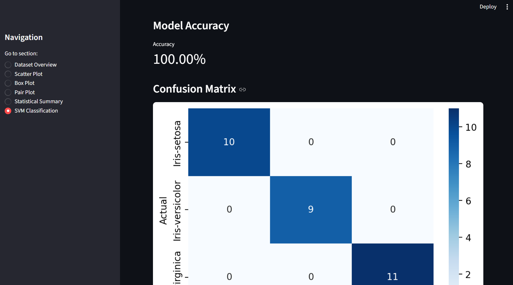

# 🌸 Iris Dataset Analysis Dashboard

An interactive and structured dashboard for exploring the classic **Iris dataset**, including EDA, statistical summaries, visualizations, and a simple SVM classification model.

---

## 📌 Dataset  
Source:  
https://www.kaggle.com/datasets/uciml/iris

The dataset contains 150 samples of iris flowers with four numerical features:

- SepalLengthCm  
- SepalWidthCm  
- PetalLengthCm  
- PetalWidthCm  

Target label:  
- Species (Iris-setosa, Iris-versicolor, Iris-virginica)

---

## 📊 Dashboard Features

### **1. Dataset Overview**
Displays the first rows, dataset description, and column information.



---

### **2. Scatter Plot**
Petal Length vs Petal Width comparison across species.



---

### **3. Pair Plot**
Multi-feature visualization showing relationships between all features.



---

### **4. SVM Classification**
A linear SVM model is trained to classify iris species.  
The model achieves **100% accuracy**, which is expected due to the clean separation of classes.

Includes:

- Accuracy metric  
- Confusion matrix  



---

## 📁 Project Structure

```
Iris_Dashboard.py
Iris.csv
images/
    img1.png
    img2.png
    img3.png
    img4.png
README.md
```

---

## 🚀 How to Run

Install Streamlit:

```
pip install streamlit
```

Run the dashboard:

```
streamlit run Iris_Dashboard.py
```

---

## ✔ Summary

This dashboard provides:

- Clean EDA  
- Clear visualizations  
- Statistical summaries  
- A simple but effective ML model  
- A professional and easy-to-use interface  

Perfect for learning, teaching, or showcasing ML/EDA skills.

---

## داشبورد تحلیل دیتاست Iris

این پروژه یک داشبورد تمیز و تعاملی برای بررسی دیتاست معروف Iris است.  
بخش‌های اصلی شامل:

- نمایش اولیهٔ داده‌ها  
- نمودارهای تحلیلی  
- Pair Plot  
- خلاصهٔ آماری  
- مدل SVM با دقت ۱۰۰٪  

برای اجرا:

```
streamlit run Iris_Dashboard.py
```

عکس‌ها در پوشهٔ `images/` قرار دارند.

