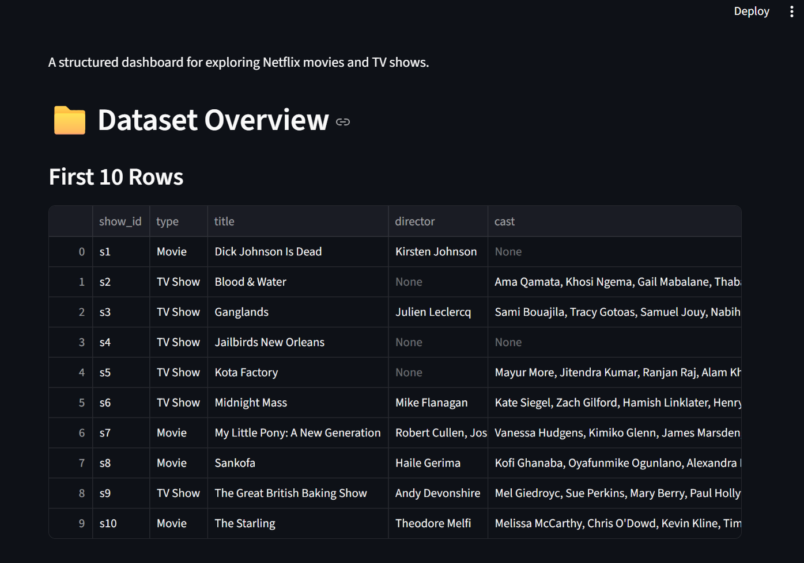
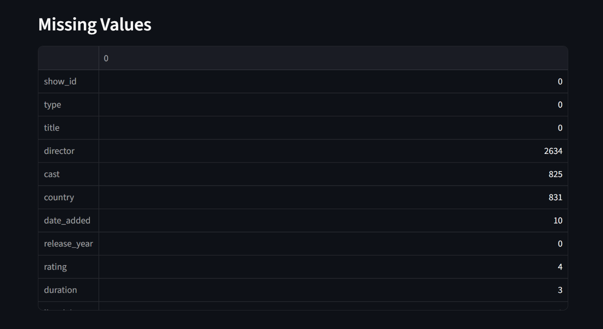
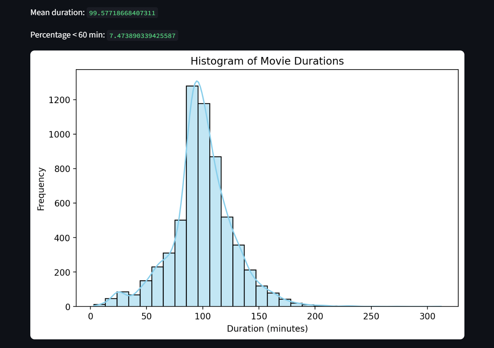
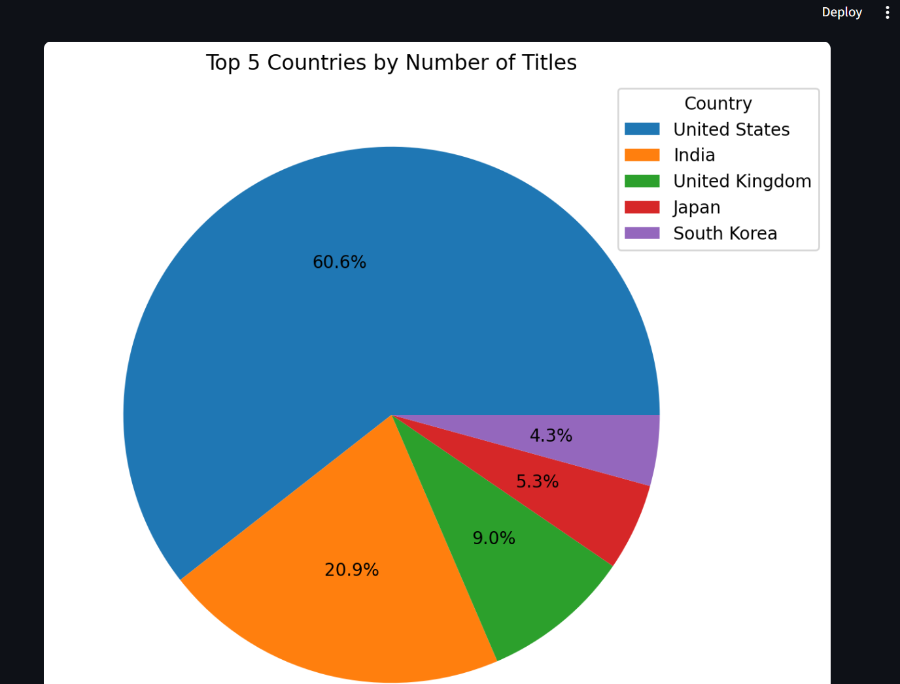
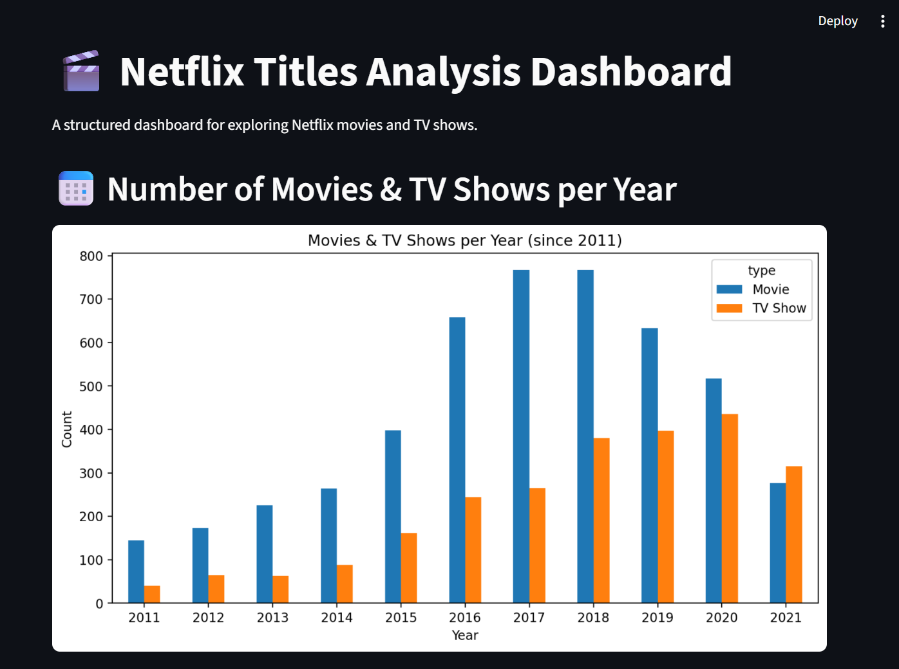
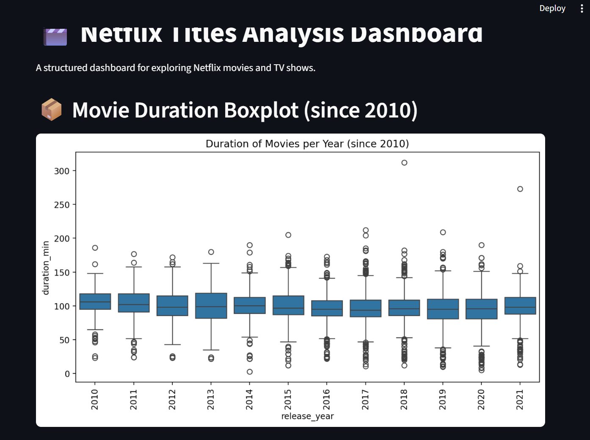
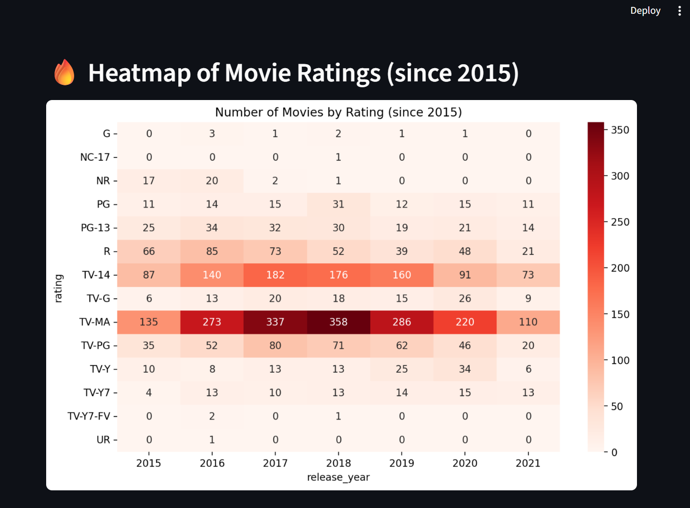
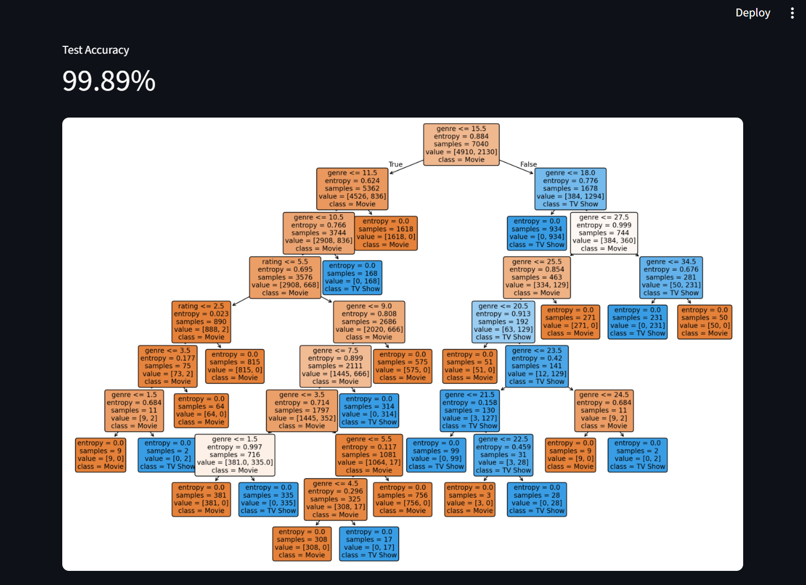

# 🎬 Netflix Titles Analysis Dashboard

An interactive and structured dashboard for exploring the **Netflix Shows Dataset**, including EDA, visualizations, and a Decision Tree classification model.

Dataset source:  
https://www.kaggle.com/datasets/shivamb/netflix-shows

---

## 📁 Dataset Overview

This dataset contains metadata for Netflix movies and TV shows, including:

- Title  
- Type (Movie / TV Show)  
- Director  
- Cast  
- Country  
- Rating  
- Duration  
- Genre  
- Release year  

### **First 10 Rows**


### **Missing Values**


---

## 📊 Movie Duration Analysis

We analyze movie durations by converting `"duration"` from text (e.g., `"90 min"`) into integer minutes.

- **Mean duration:** ~100 minutes  
- **Movies < 60 min:** ~7.47%

### **Histogram of Movie Durations**


---

## 🌍 Country Distribution

Top 5 countries with the highest number of titles on Netflix.

### **Pie Chart**


---

## 📅 Movies & TV Shows per Year

A bar chart showing how Netflix content has grown over time (since 2011).

### **Bar Chart**


---

## 📦 Movie Duration Boxplot (since 2010)

A boxplot showing how movie durations vary year by year.

### **Boxplot**


---

## 🔥 Heatmap of Movie Ratings (since 2015)

This heatmap shows the number of movies per rating category each year.

⚠ **Note:**  
Netflix uses **TV-style ratings** (TV-MA, TV-14, TV-PG, etc.) even for *movies*.  
This is normal and part of Netflix’s internal rating system.

### **Heatmap**


---

## 🌳 Decision Tree Classification (Movie vs TV Show)

A simple Decision Tree model is trained using:

- Encoded Rating  
- Encoded Genre  

The model predicts whether a title is a **Movie** or **TV Show**.

### **Decision Tree Visualization**


---

## 📁 Project Structure

```
Netflix_Analysis.ipynb
Netflix_Dashboard.py
netflix_titles.csv
images/
    img1.png
    img2.png
    img3.png
    img4.png
    img5.png
    img6.png
    img7.png
    img8.png
README.md
```

---

## 🚀 How to Run the Dashboard

Install Streamlit:

```
pip install streamlit
```

Run the dashboard:

```
streamlit run Netflix_Dashboard.py
```

---

## داشبورد تحلیل دیتاست Netflix

این پروژه یک داشبورد کامل برای تحلیل دیتاست Netflix است و شامل:

- نمایش اولیهٔ داده‌ها  
- بررسی مقادیر گمشده  
- نمودارهای مختلف (Histogram، Pie، Bar، Boxplot، Heatmap)  
- مدل درخت تصمیم برای تشخیص Movie / TV Show  

### نکتهٔ مهم  
نتفلیکس برای فیلم‌ها هم از Ratingهای TV مثل **TV-MA** و **TV-14** استفاده می‌کند.  
این کاملاً طبیعی است و بخشی از سیستم داخلی نتفلیکس است.

### اجرا:

```
streamlit run Netflix_Dashboard.py
```

عکس‌ها در پوشهٔ `images/` قرار دارند.

