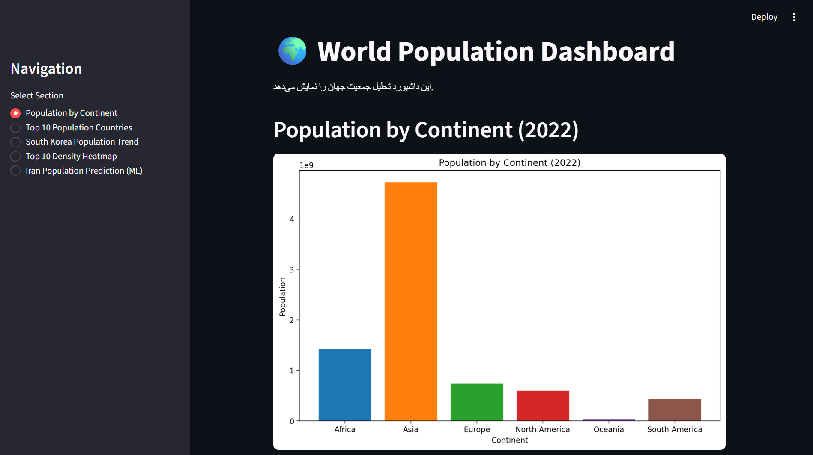
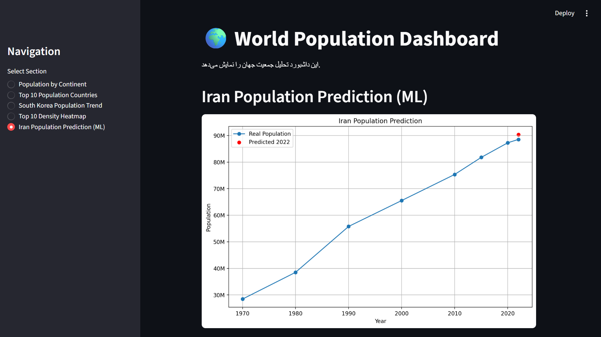

# 🌍 World Population Analysis & Interactive Dashboard

This project provides a comprehensive analysis of the global population using the **World Population Dataset** from Kaggle:

🔗 Dataset Link:  
https://www.kaggle.com/datasets/iamsouravbanerjee/world-population-dataset

The goal of this project is to explore population trends, visualize key demographic insights, and build an interactive dashboard using **Streamlit**. The dashboard allows users to navigate through multiple visualizations and a simple machine learning prediction model.

---

## 📸 Screenshots

### Dashboard Home

### Iran Population Prediction (ML)

---

## 📊 Features & Visualizations

### 1. Population by Continent (2022)
A bar chart showing the total population of each continent in 2022.

### 2. Top 10 Most Populated Countries
A pie chart visualizing the top 10 countries by population.

### 3. South Korea Population Trend
A line chart showing South Korea’s population growth from 2000 to 2022.

### 4. Highest Population Density Countries
A heatmap highlighting the top 10 countries with the highest population density.

### 5. Iran Population Prediction (Machine Learning)
A simple **Linear Regression** model trained on Iran’s historical population data (1970–2020) to predict the population for 2022.  
The prediction is compared with the actual 2022 value to evaluate model performance.

---

## 🧠 Machine Learning Approach

- Model: **Linear Regression**
- Training Data: Iran population from 1970 to 2020  
- Test Data: Year 2022 (excluded from training)
- Purpose: Demonstrate a lightweight ML prediction inside the dashboard  
- Note: The dataset is small and population growth is not perfectly linear, so the prediction is intended for demonstration rather than high accuracy.

---

## 🖥️ Streamlit Dashboard

The entire analysis is integrated into a clean and interactive Streamlit app with sidebar navigation:

- Population by Continent  
- Top 10 Countries  
- South Korea Trend  
- Density Heatmap  
- Iran ML Prediction  

Run the dashboard using:

streamlit run Dashboard.py

---

## ✔️ Challenges & Notes

This dataset was clean and well‑structured, so no major issues were encountered.  
Minor adjustments included:

- Handling large population numbers (removing scientific notation)
- Formatting axes for readability (e.g., showing values in millions)
- Ensuring consistent color palettes across charts
- Structuring the dashboard into clear sections

---

## 📦 Technologies Used

- Python  
- Pandas  
- Matplotlib  
- Seaborn  
- Scikit‑Learn  
- Streamlit  

---

## 📁 Dataset Source

World Population Dataset (Kaggle)  
https://www.kaggle.com/datasets/iamsouravbanerjee/world-population-dataset

---

# داشبورد تحلیل جمعیت جهان

این پروژه یک تحلیل کامل از دیتاست جمعیت جهان انجام می‌دهد و شامل نمودارهای مختلف و یک مدل یادگیری ماشین ساده است.  
دیتاست از Kaggle دریافت شده است:

🔗 لینک دیتاست:  
https://www.kaggle.com/datasets/iamsouravbanerjee/world-population-dataset

---

## بخش‌های داشبورد
- جمعیت قاره‌ها در سال 2022  
- ده کشور پرجمعیت جهان  
- روند جمعیت کره جنوبی  
- Heatmap تراکم جمعیت  
- پیش‌بینی جمعیت ایران با Linear Regression  

## یادگیری ماشین
مدل Linear Regression روی داده‌های 1970 تا 2020 ایران آموزش داده شده و جمعیت 2022 را پیش‌بینی می‌کند.  
این بخش بیشتر جنبهٔ نمایشی دارد چون دیتاست کوچک است.

## نکات
این دیتاست تمیز و بدون مشکل خاص بود.  
فقط موارد زیر اصلاح شد:
- حذف scientific notation  
- نمایش جمعیت به صورت میلیون  
- یکپارچه‌سازی رنگ‌ها  
- ساختاردهی داشبورد در Streamlit  

## اجرای داشبورد:
streamlit run Dashboard.py
